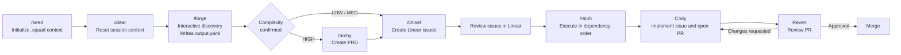

# Agent Squad

A personal multi-agent development workflow built on Claude Code.

Forge → Archy → Chisel → Ralph → Cody → Reven

## MVP Flow



The diagram shows the current manual MVP: `Seed` prepares context, `Forge`
structures the work, `Archy` appears only for `HIGH` complexity, `Chisel`
creates Linear issues, `Ralph` drives execution through `Cody`, and `Reven`
reviews before merge.

Source: [assets/mvp-flow.mmd](C:\Users\Giorgio\Desktop\projects\agent-squad\assets\mvp-flow.mmd)

## What's in this repo

```
agent-squad/
  JOURNAL.md        Design journal: iterations, decisions, open points
  CODEX.md          Adaptation guide for Codex CLI
  README.md         This file
  skills/
    forge/          Interactive brainstorming → .squad/forge/output.yaml
    archy/          Architecture analysis → .squad/prd/current.md (HIGH only)
    chisel/         YAML/PRD → Linear issues
    seed/           Project initialization → .squad/ context files
    ralph/          Agentic loop invoking Cody
  agents/
    cody.md         Implements Linear issues, creates branch, opens PR
    reven.md        Code reviewer
```

## Quick start

```bash
# 1. Copy skills and agents to Claude Code global config
cp -r skills/* ~/.claude/skills/
cp -r agents/* ~/.claude/agents/

# 2. In your project, run Seed
/seed

# 3. Clear context, then start
/clear
/forge <your idea>
```

## Workflow data

All runtime files live in `.squad/` inside your project — not in this repo. `.squad/` is tool-agnostic and works with both Claude Code and Codex.

```
your-project/
  .squad/
    architecture.md       written by Seed
    scout-cache.md        written by Seed
    decisions.md          maintained by you
    forge/output.yaml     written by Forge
    prd/current.md        written by Archy
    prd/archive/          archived by Chisel
    chisel-config.json    written on first Chisel run
```

## For Codex

See `CODEX.md` for the full list of changes needed (MCP prefix, model names, directory paths, unsupported features).

## Further reading

`JOURNAL.md` contains the full design history: why each component exists, what was tried and rejected, and when to add the next layer.
