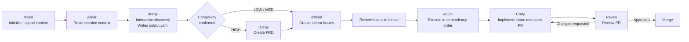

# Agent Squad

A personal multi-agent development workflow with separate Claude Code and
Codex distributions.

Forge -> Archy -> Chisel -> Ralph -> Cody -> Reven

## MVP Flow

```text
lore start      Read second-brain, orient companion. Run at start of squad sessions.
/seed           Initialize .squad/ AND scaffold second-brain project files.
/clear          Reset session context.
/forge          Interactive discovery, writes output.yaml.
/archy          (HIGH only) Create PRD.
/chisel         Create Linear issues.
/ralph          Execute issues in dependency order (invokes Cody).
Cody            Implement issue and open PR.
Reven           Review PR.
lore end        Propose status.md + session log writes. Confirm before writing.
```



The diagram shows the current manual MVP: `Lore` manages second-brain memory, `Seed` prepares context, `Forge`
structures the work, `Archy` appears only for `HIGH` complexity, `Chisel`
creates Linear issues, `Ralph` drives execution through `Cody`, and `Reven`
reviews before merge.

Source: [assets/mvp-flow.mmd](/abs/path/C:/Users/Giorgio/Desktop/projects/agent-squad/assets/mvp-flow.mmd:1)

## What's in this repo

```text
agent-squad/
  JOURNAL.md        Design journal: iterations, decisions, open points
  PLATFORM_DIFFERENCES.md
                    Semantic and technical differences between trees
  README.md         This file
  claude/
    skills/
      forge/        Interactive brainstorming -> .squad/forge/output.yaml
      archy/        Architecture analysis -> .squad/prd/current.md
      chisel/       YAML/PRD -> Linear issues
      seed/         Project initialization -> .squad/ context files
      ralph/        Agentic loop invoking Cody
    agents/
      cody.md       Claude agent definition for implementation
      reven.md      Claude agent definition for review
      lore.md       Claude agent for second-brain memory
  codex/
    skills/
      forge/        Codex skill variants
      archy/
      chisel/
      seed/
      ralph/
    agents/
      cody.toml     Codex custom agent
      reven.toml    Codex custom agent
      lore.toml     Codex custom agent for second-brain
```

## Quick start

```bash
# Claude Code
cp -r claude/skills/* ~/.claude/skills/
cp -r claude/agents/* ~/.claude/agents/
```

```bash
# Codex
cp -r codex/skills/* ~/.agents/skills/
cp -r codex/agents/* ~/.codex/agents/
```

Then, in your project:

```bash
# Claude Code
/seed
/clear
/forge <your idea>
```

```text
# Codex
Use the `seed` skill, then start a fresh session if desired, then use
the `forge` skill.
```

## Workflow data

All runtime files live in `.squad/` inside your project, not in this repo.
`.squad/` is tool-agnostic and works with both Claude Code and Codex.
Agent Squad does not modify `AGENTS.md` or `CLAUDE.md`; skills and agents read
`.squad/` files directly when needed.

```text
your-project/
  .squad/
    architecture.md       written by Seed
    scout-cache.md        written by Seed
    decisions.md          maintained by you
    forge/output.yaml     written by Forge
    prd/current.md        written by Archy
    prd/archive/          archived by Chisel
    chisel-config.json    written on first Chisel run
  second-brain/
    INDEX.md              Vault entry point. Read by all companions via Lore at session start.
    preferences/
      development.md      Global cross-tool preferences. Written by Lore via `lore prefer`. Capped at 100 lines.
    projects/<name>/
      status.md           Resumption handoff. Overwritten by Lore at session end. Checkpointed by Cody at PR open.
      decisions.md        Key decisions log. Append-only. Written by Lore (Codex) or auto-memory (Claude Code).
    experiences/YYYY-MM/  Monthly session logs. Appended by Lore at session end. Never loaded by default.
```

## Claude vs Codex

See `PLATFORM_DIFFERENCES.md` for the exact semantic and technical
differences between the `claude/` and `codex/` sets.

## Further reading

`JOURNAL.md` contains the full design history: why each component exists,
what was tried and rejected, and when to add the next layer.
