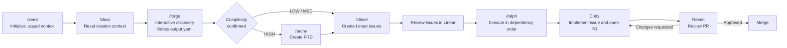

# Agent Squad

A personal multi-agent development workflow with separate Claude Code and
Codex distributions.

Forge -> Archy -> Chisel -> Ralph -> Cody -> Reven

## MVP Flow

```text
/lore start     Read second-brain, orient companion. Run at start of squad sessions.
/seed           Initialize .squad/ AND scaffold second-brain project files.
/clear          Reset session context.
/forge          Interactive discovery, writes output.yaml.
/archy          (HIGH only) Create PRD.
/chisel         Create Linear issues.
/ralph          Execute issues in dependency order (invokes Cody).
Cody            Implement issue and open PR.
Reven           Review PR.
/lore end       Announce status.md + session log writes, then write (Tier 1). Confirm only destructive cases.
```



The diagram shows the current manual MVP: `Lore` manages second-brain memory, `Seed` prepares context, `Forge`
structures the work, `Archy` appears only for `HIGH` complexity, `Chisel`
creates Linear issues, `Ralph` drives execution through `Cody`, and `Reven`
reviews before merge.

## What's in this repo

```text
agent-squad/
  JOURNAL.md        Design journal: iterations, decisions, open points
  PLATFORM_DIFFERENCES.md
                    Semantic and technical differences between trees
  README.md         This file
  claude/
    skills/
      forge/        Interactive brainstorming -> .squad/forge/output.yaml
      archy/        Architecture analysis -> .squad/prd/current.md
      chisel/       YAML/PRD -> Linear issues
      seed/         Project initialization -> .squad/ context files
      ralph/        Agentic loop invoking Cody
      lore/         Slash-command wrapper delegating to the Lore agent
    agents/
      cody.md       Claude agent definition for implementation
      reven.md      Claude agent definition for review
      lore.md       Claude agent for second-brain memory
  codex/
    skills/
      forge/        Codex skill variants
      archy/
      chisel/
      seed/
      ralph/
      lore/         Wrapper delegating to the Lore agent
    agents/
      cody.toml     Codex custom agent
      reven.toml    Codex custom agent
      lore.toml     Codex custom agent for second-brain
```

## Installation

Squad is installed globally. No files need to be added to any host project.
After install, Squad is available in every project immediately.

> Warning: if you already have files named `lore`, `cody`, `reven`, `forge`,
> `archy`, `chisel`, `seed`, or `ralph` in `~/.claude/agents/`,
> `~/.claude/skills/`, `~/.codex/agents/`, or `~/.agents/skills/`, they will
> be overwritten by the commands below.

```bash
# Claude Code
cp -r claude/agents/* ~/.claude/agents/
cp -r claude/skills/* ~/.claude/skills/
```

```bash
# Codex
cp -r codex/agents/* ~/.codex/agents/
cp -r codex/skills/* ~/.agents/skills/
```

## Quick start

Once installed, open any project and run:

```bash
# Claude Code
/lore start
/seed
/clear
/forge <your idea>
```

```text
# Codex
Invoke the lore agent with `lore start`, then use the `seed` skill, then
start a fresh session if desired, then use the `forge` skill.
```

## Vault setup

On the first `/lore start` (Claude Code) or `lore start` (Codex), Lore creates the vault automatically.

- Default vault location: `~/second-brain/`
- Override with the `SECOND_BRAIN_PATH` environment variable:
  `export SECOND_BRAIN_PATH=/path/to/your/vault`
- `lore-config.json` lives at the vault root (`~/second-brain/lore-config.json`
  by default).
- Per-project `.squad/` state lives inside the vault at
  `<vault>/projects/<project-name>/.squad/`, not in the host project directory.
- Recommended: initialize the vault as a private git repository. It is the
  single source of truth for all squad memory; a repo gives it history,
  backup, and multi-machine sync at zero cost. When the repo exists,
  `lore end` and `lore recover` commit after their confirmed writes
  (commit only, never push); pulling and pushing stay manual. Pull before
  starting work when using multiple machines.

Host projects have zero Squad footprint — no `.squad/` directory, no config
files are written to the project itself.

## Workflow data

All runtime files live in the vault, not in your project directory.
`.squad/` is tool-agnostic and works with both Claude Code and Codex.
Agent Squad does not modify `AGENTS.md` or `CLAUDE.md`; skills and agents read
vault files directly when needed.

```text
~/second-brain/                    (or $SECOND_BRAIN_PATH)
  lore-config.json                 Vault config. Written by Lore on first start.
  INDEX.md                         Vault entry point. Read by all companions via Lore at session start.
  preferences/
    development.md                 Global cross-tool preferences. Written by Lore via `lore prefer`. Capped at 100 lines.
  projects/<name>/
    .squad/
      architecture.md              written by Seed
      scout-cache.md               written by Seed
      decisions.md                 maintained by you
      forge/output.yaml            written by Forge
      prd/current.md               written by Archy
      prd/archive/                 archived by Chisel
      chisel-config.json           written on first Chisel run
      issues/                      detached-mode batch files and handoffs
      progress.txt                 Ralph's per-issue batch memory. Read by Cody.
    status.md                      Resumption handoff. Overwritten by Lore at session end. Checkpointed by Cody at PR open.
    decisions.md                   Key decisions log. Append-only. Written by Lore on both platforms.
  experiences/YYYY-MM/             Monthly session logs. Appended by Lore at session end. Never loaded by default.
```

## Tracker modes

`chisel.mode` in `chisel-config.json` selects how the squad talks to your
issue tracker. `connected` (default) creates and updates Linear issues via
MCP and opens PRs with `gh`. `detached` keeps agents fully hands-off:
Chisel writes a local batch file (with a Jira-importable CSV), Ralph
executes from it and produces a handoff checklist you replay into the
tracker, Cody commits locally and prints a paste-ready PR description
without pushing. Use detached in work environments where agents must not
hold write access to company tools, or as a fallback when the tracker MCP
is down. The thinking layers (Forge, Archy, Seed, Lore, Reven's review
logic) are identical in both modes.

When using the squad across trust domains (personal and work), use one
vault per domain via `SECOND_BRAIN_PATH`, for example with direnv or a
shell profile on the work machine. Do not share a vault between domains:
INDEX.md and preferences are written on every session and would carry
work context into a personal remote.

## Claude vs Codex

See `PLATFORM_DIFFERENCES.md` for the exact semantic and technical
differences between the `claude/` and `codex/` sets.

## Further reading

`JOURNAL.md` contains the full design history: why each component exists,
what was tried and rejected, and when to add the next layer.
