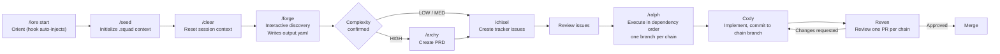

# Agent Squad

A personal multi-agent development workflow with separate Claude Code and
Codex distributions.

Forge -> Archy -> Chisel -> Ralph -> Cody -> Reven

Sidecar -> Cody, on an existing branch, once (a companion entry point for
iterative fixes — see "Sidecar" below)

## MVP Flow

```text
/lore start     Orient companion (auto-injected by the SessionStart hook if installed; run manually for setup).
/seed           Initialize .squad/ AND scaffold second-brain project files.
/clear          Reset session context.
/forge          Interactive discovery, writes output.yaml.
/archy          (HIGH only) Create PRD.
/chisel         Create tracker issues (GitHub in connected mode, a local batch file in detached mode).
/ralph          Execute issues in dependency order, one branch per dependency chain (invokes Cody).
Cody            Implement issue, commit to the chain branch, open one PR per chain.
Reven           Review PR.
(no session-end command) status.md reconstructs from evidence on the next /lore start; run /lore recover to rebuild it explicitly.
```


```mermaid
graph LR
    S["/lore start<br/>Orient (hook auto-injects)"] --> A["/seed<br/>Initialize .squad context"]
    A --> B["/clear<br/>Reset session context"]
    B --> C["/forge<br/>Interactive discovery<br/>Writes output.yaml"]
    C --> D{"Complexity<br/>confirmed"}
    D -->|HIGH| E["/archy<br/>Create PRD"]

    F["/chisel<br/>Create tracker issues"] --> G["Review issues"]
    G --> H["/ralph<br/>Execute in dependency order<br/>one branch per chain"]
    H --> I["Cody<br/>Implement, commit to chain branch"]
    I --> J["Reven<br/>Review one PR per chain"]
    J -->|Approved| K["Merge"]
    J -->|Changes requested| I

    D -->|LOW / MED| F
    E --> F
```

The diagram shows the current manual MVP: `Lore` manages second-brain memory, `Seed` prepares context, `Forge`
structures the work, `Archy` appears only for `HIGH` complexity, `Chisel`
creates tracker issues (GitHub issues in connected mode, or a local batch
file in detached mode), `Ralph` drives execution through `Cody` one branch
per dependency chain, and `Reven` reviews before merge.

## Sidecar: iterating on an existing branch

The MVP flow above is sized for a batch of tracker issues. It's the wrong
tool for "this UI piece is wrong on the branch I already have out" —
re-running Forge and Chisel just to describe a fix to a branch that
already exists is pure ceremony, and talking straight to the codebase
instead leaves no trail in the vault.

`/sidecar <branch-name>` is the companion entry point for that case. It
does not touch Forge, Archy, Chisel, or Ralph. Given a branch that
already exists (typically one with an open PR, or one Ralph committed
but hasn't closed), it:

1. Creates a git worktree for that branch inside the project directory —
   a real, disposable working copy so you can run and test it without
   disturbing your main checkout.
2. Orients from the diff against the branch's base, not from a full
   re-read of prior planning docs.
3. Invokes Cody once per fix you describe, committing each one in the
   worktree.
4. On "done": pushes and opens/updates the PR (or prints the paste-ready
   description in detached mode), writes one summary line to
   `progress.txt`, and removes the worktree.

The worktree is an intentional exception to the squad's usual
zero-footprint rule: unlike `.squad/` state, it is not squad memory, just
an ordinary disposable checkout, git-ignored in the host project and
gone by the time Sidecar closes. The evidence trail lands in the same
`progress.txt` Ralph already writes to — one line per Sidecar session,
not one per fix, since issues at this stage are small enough that a
session-level summary is enough. Reven is never invoked automatically;
run it yourself when you're ready for another review pass.

## What's in this repo

```text
agent-squad/
  .github/
    workflows/
      issue-lifecycle.yml
                    On PR merge/close, closes the linked issue and clears
                    its state labels (in-progress/in-review/needs-review).
                    Label names are hardcoded here — not read from
                    chisel-config.json, which lives outside this repo.
  JOURNAL.md        Design journal: iterations, decisions, open points
  PLATFORM_DIFFERENCES.md
                    Semantic and technical differences between trees
  PATH_RESOLUTION.md
                    Algorithm and rationale behind path-resolve.sh. Docs
                    only — never read at runtime; the script is what runs.
  README.md         This file
  claude/
    skills/
      forge/        Interactive brainstorming -> .squad/forge/output.yaml
      archy/        Architecture analysis -> .squad/prd/current.md
      chisel/       YAML/PRD -> GitHub issues
      seed/         Project initialization -> .squad/ context files
      ralph/        Agentic loop invoking Cody
      sidecar/      Worktree-backed iterative fix session on an existing branch
      lore/         Slash-command wrapper delegating to the Lore agent
    agents/
      cody.md       Claude agent definition for implementation
      reven.md      Claude agent definition for review
      lore.md       Claude agent for second-brain memory
    hooks/
      path-resolve.sh Shared vault/project-root resolution. Required —
                       every skill and agent calls it as step one.
      worktree.sh      create/path/remove worktree lifecycle mechanism
                       (used today by Sidecar; Ralph's epic mode will
                       consume it too — see the "Worktree hook" section
                       below).
      lore-orient.sh   SessionStart read-only orientation script (optional)
  codex/
    skills/
      forge/        Codex skill variants
      archy/
      chisel/
      seed/
      ralph/
      sidecar/      Worktree-backed iterative fix session on an existing branch
      lore/         Wrapper delegating to the Lore agent
    agents/
      cody.toml     Codex custom agent
      reven.toml    Codex custom agent
      lore.toml     Codex custom agent for second-brain
    hooks/
      path-resolve.sh Shared vault/project-root resolution. Required —
                       every skill and agent calls it as step one.
      lore-orient.sh   SessionStart read-only orientation script (optional)
```

## Installation

Squad is installed globally. No files need to be added to any host project.
After install, Squad is available in every project immediately.

> Warning: if you already have files named `lore`, `cody`, `reven`, `forge`,
> `archy`, `chisel`, `seed`, or `ralph` in `~/.claude/agents/`,
> `~/.claude/skills/`, `~/.codex/agents/`, or `~/.agents/skills/`, they will
> be overwritten by the commands below.

```bash
# Claude Code
cp -r claude/agents/* ~/.claude/agents/
cp -r claude/skills/* ~/.claude/skills/
mkdir -p ~/.claude/hooks
cp claude/hooks/path-resolve.sh ~/.claude/hooks/ && chmod +x ~/.claude/hooks/path-resolve.sh
cp claude/hooks/chisel-config-validate.py ~/.claude/hooks/ && chmod +x ~/.claude/hooks/chisel-config-validate.py
cp claude/hooks/worktree.sh ~/.claude/hooks/ && chmod +x ~/.claude/hooks/worktree.sh
```

```bash
# Codex
cp -r codex/agents/* ~/.codex/agents/
cp -r codex/skills/* ~/.agents/skills/
mkdir -p ~/.codex/hooks
cp codex/hooks/path-resolve.sh ~/.codex/hooks/ && chmod +x ~/.codex/hooks/path-resolve.sh
cp codex/hooks/chisel-config-validate.py ~/.codex/hooks/ && chmod +x ~/.codex/hooks/chisel-config-validate.py
```

`path-resolve.sh` is not optional: every skill and agent's "Path
resolution protocol" calls it as its first step (see
`PATH_RESOLUTION.md`). Without it installed, nothing in the squad can
resolve which vault project it's talking to.

## Worktree hook

`claude/hooks/worktree.sh` extracts worktree lifecycle management
(create, locate, remove) out of skill prose into an executable,
testable mechanism. Sidecar consumes it today; Ralph's future epic mode
is specified against the same `create`/`path`/`remove` contract.

It follows `path-resolve.sh`'s conventions: `KEY=VALUE` lines on
stdout, mechanism only (no policy — Sidecar still owns when to warn,
what to say, and when to ask the user for confirmation), no interactive
prompts. It resolves its own project root via `path-resolve.sh`
(expected as a sibling file) and never calls
`git rev-parse --show-toplevel`, which returns a linked worktree's own
directory rather than the main project's when run from inside one.

Exit codes: `0` success, `1` a refusal the caller must surface (never a
forced operation), `2` an internal error.

```bash
worktree.sh create <branch>   # WORKTREE_PATH=..., WORKTREE_CREATED=true|false
worktree.sh path <branch>     # WORKTREE_PATH=...
worktree.sh remove <branch>   # REMOVED=true|false, CLEANED=<paths>
```

Depends only on `git` and POSIX shell utilities — no `jq`.

Install alongside `path-resolve.sh`:

```bash
cp claude/hooks/worktree.sh ~/.claude/hooks/ && chmod +x ~/.claude/hooks/worktree.sh
```

Hooks are consumed from `~/.claude/hooks/`, not from the checkout — a
reinstall (re-running the copy command above) is required before this
change takes effect for any skill that starts calling it.

A `codex/hooks/worktree.sh` mirror is deliberately not written yet; it
depends on a pending decision about dropping the codex distribution
entirely.


`chisel-config-validate.py` is an optional CI-style gate that checks
every `chisel-config.json` in the vault against the schema documented in
that platform's own `chisel/SKILL.md`. It is not invoked automatically
by any skill or agent — run it manually (`--prune` to remove flagged
keys; read-only otherwise).

### Optional: SessionStart auto-orientation

A read-only hook can inject "where you left off" at the start of every
session, so you do not have to ask. It never writes and never blocks. It
also calls `path-resolve.sh`, so install that first if you haven't.

```bash
# Claude Code
cp claude/hooks/lore-orient.sh ~/.claude/hooks/ && chmod +x ~/.claude/hooks/lore-orient.sh
```
Then add to `~/.claude/settings.json`:
```json
{ "hooks": { "SessionStart": [ { "hooks": [
  { "type": "command", "command": "~/.claude/hooks/lore-orient.sh" } ] } ] } }
```

```bash
# Codex
cp codex/hooks/lore-orient.sh ~/.codex/hooks/ && chmod +x ~/.codex/hooks/lore-orient.sh
```
Then add to `~/.codex/config.toml`:
```toml
[[hooks.SessionStart]]
[[hooks.SessionStart.hooks]]
type = "command"
command = '"$HOME/.codex/hooks/lore-orient.sh"'
```

The hook orients (read-only); `/lore start` still handles the write and
setup path (first-time naming, migration, session-log reset).

## Quick start

Once installed, open any project and run:

```bash
# Claude Code
/lore start          # or skip if the SessionStart hook is installed (it auto-orients)
/seed
/clear
/forge <your idea>
```

```text
# Codex
Invoke the lore agent with `lore start`, then use the `seed` skill, then
start a fresh session if desired, then use the `forge` skill.
```

## Vault setup

On the first `/lore start` (Claude Code) or `lore start` (Codex), Lore creates the vault automatically.

- Default vault location: `~/second-brain/`
- Override with the `SECOND_BRAIN_PATH` environment variable:
  `export SECOND_BRAIN_PATH=/path/to/your/vault`
- `lore-config.json` lives at the vault root (`~/second-brain/lore-config.json`
  by default).
- Per-project `.squad/` state lives inside the vault at
  `<vault>/projects/<project-name>/.squad/`, not in the host project directory.
- Recommended: initialize the vault as a private git repository. It is the
  single source of truth for all squad memory; a repo gives it history,
  backup, and multi-machine sync at zero cost. When the repo exists,
  `lore start`, `lore prefer`, and `lore recover` commit after their
  writes (commit only, never push); pulling and pushing stay manual. Pull
  before starting work when using multiple machines.

Host projects have zero Squad footprint — no `.squad/` directory, no config
files are written to the project itself.

## Workflow data

All runtime files live in the vault, not in your project directory.
`.squad/` is tool-agnostic and works with both Claude Code and Codex.
Agent Squad does not modify `AGENTS.md` or `CLAUDE.md`; skills and agents read
vault files directly when needed.

```text
~/second-brain/                    (or $SECOND_BRAIN_PATH)
  lore-config.json                 Vault config. Written by Lore on first start.
  INDEX.md                         Vault entry point. Read by all companions via Lore at session start.
  preferences/
    development.md                 Global cross-tool preferences. Written by Lore via `lore prefer`. Capped at 100 lines.
  projects/<name>/
    .squad/
      architecture.md              written by Seed
      scout-cache.md               written by Seed
      decisions.md                 maintained by you
      forge/output.yaml            written by Forge
      prd/current.md               written by Archy
      prd/archive/                 archived by Chisel
      chisel-config.json           written on first Chisel run
      issues/                      detached-mode batch files and handoffs
      progress.txt                 Ralph's per-issue batch memory, and Sidecar's one-line-per-session summary. Read by Cody.
    status.md                      Resumption handoff. Reconstructed by Lore on lore start/recover. Checkpointed by Cody at PR open.
    decisions.md                   Key decisions log. Append-only. Written by Lore on both platforms.
```

Sidecar is the one exception to "all runtime files live in the vault": its
git worktree (`.claude/worktrees/<branch>/` on the Claude side,
`.codex/worktrees/<branch>/` on Codex) lives inside the host project
itself, git-ignored there, and is removed when the session closes. The
Claude path matches Claude Code's own native worktree convention
(`--worktree`, `EnterWorktree`, subagent `isolation: worktree`), so it
lands exactly where most Claude Code users already expect worktree
content, and often where their `.gitignore` already excludes. It is a
disposable working copy, not squad state, so it does not follow the
zero-footprint rule above.

## Tracker modes

`chisel.mode` in `chisel-config.json` selects how the squad talks to your
issue tracker. `connected` (default) creates and updates GitHub issues and
opens PRs, both via `gh`; there is no tracker to choose between in this
mode. `detached` keeps agents fully hands-off:
Chisel writes a local batch file (with a Jira-importable CSV), Ralph
executes from it and produces a handoff checklist you replay into the
tracker, Cody commits locally and prints a paste-ready PR description
without pushing. Use detached in work environments where agents must not
hold write access to company tools, or as a fallback when the tracker MCP
is down. The thinking layers (Forge, Archy, Seed, Lore, Reven's review
logic) are identical in both modes.

### Installing the issue-lifecycle workflow (connected mode)

`.github/workflows/issue-lifecycle.yml` in *this* repository is what
reconciles Agent Squad's own issues. It is not something a project using
the squad in `connected` mode already has — connected-mode issues live
in *your* project's repository, and this workflow only ships inside
`agent-squad/.github/`, so nothing installs it there automatically. No
agent in the squad writes CI configuration into your repository on your
behalf: creating issues and labels via `gh` is a small, per-action,
reviewable operation; committing a GitHub Actions workflow that runs on
every PR close and can close issues is a standing change to your CI
pipeline, and that decision is left to you.

To get the same terminal-state reconciliation (closing an issue and
clearing its state labels when the linked PR merges, clearing
`in-review` when a PR closes without merging, and restoring `in-review`
if the issue is later reopened) in your own project:

1. Copy `.github/workflows/issue-lifecycle.yml` from this repository
   into your project's `.github/workflows/`.
2. Create the labels it expects to exist, if they don't already (Chisel
   creates these for you on its first connected run in your project, so
   if Chisel has already run there you can skip this step):
   - `in-progress`
   - `in-review`
   - `needs-review` (or whatever you set `review_label` to in
     `chisel-config.json` — see the note below)
3. In your repository's Settings → Actions → General, set "Workflow
   permissions" to "Read and write permissions". The workflow requests
   `issues: write` in its own `permissions:` block, but that setting
   can still force it read-only and cause 403s on label removal or
   issue close.

The three label names above (`in-progress`, `in-review`, `needs-review`)
are hardcoded inside the workflow file, not read from
`chisel-config.json` (that file lives in your vault, outside the repo,
and is not available to a GitHub Actions runner). If you customize
`state_labels` or `review_label` in your vault config, edit the
`STATE_LABELS` list in your copy of the workflow to match, or the two
will silently drift apart. No agent merges PRs or performs this
reconciliation step itself — see the comments in
`.github/workflows/issue-lifecycle.yml` for the full resolution logic
and label-name caveats.

When using the squad across trust domains (personal and work), use one
vault per domain via `SECOND_BRAIN_PATH`, for example with direnv or a
shell profile on the work machine. Do not share a vault between domains:
INDEX.md and preferences are written on every session and would carry
work context into a personal remote.

## Claude vs Codex

See `PLATFORM_DIFFERENCES.md` for the exact semantic and technical
differences between the `claude/` and `codex/` sets.

## Further reading

`JOURNAL.md` contains the full design history: why each component exists,
what was tried and rejected, and when to add the next layer.
